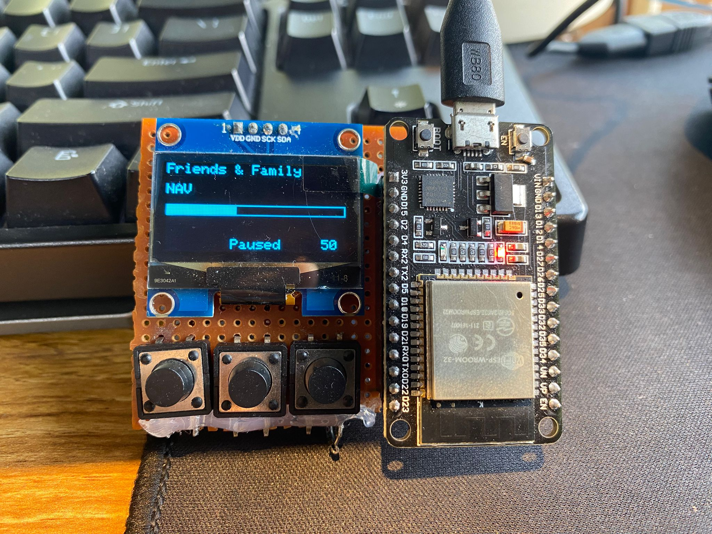

  <h3 align="center">ESP Spotify Player</h3>

  <p align="center">
    An ESP32 based Spotify Player.
    <br />
    <a href="https://github.com/kaustubhdoval/ESP-Spotify-Player"><strong>Explore the docs »</strong></a>
    <br />
    <br />
    ·
    <a href="https://github.com/kaustubhdoval/ESP-Spotify-Player/issues">Report Bug</a>
    ·
    <a href="https://github.com/kaustubhdoval/ESP-Spotify-Player/issues">Request Feature</a>
    ·
  </p>
</p>

A Physical Spotify Controller using an ESP32, 3 Buttons, Rotary Encoder and a 128x64 OLED Screen (SH1106).
<br/> <br/>

<br/><br/>

## User Guide

1. Plug the ESP to Power
2. Navigate to the ESP_IP and login to Your Spotify Account
3. Your Device should now be able to Control Music!

<br /><br />

## Setup

You need to have an **application on the Spotify API Dashboard**. Make sure that it has Web API enabled. You need to make the following modifications to the provided code:

1. Rename the 'secrets_EXAMPLE.h' file to 'secrets.h'
2. Change the placeholder values in 'secrets.h' to your values
3. Run the program, You can see your ESPs IP on Serial Monitor (115200 Baud Rate) and on the OLED.
   You need to add the IP address of your ESP to REDIRECT_URI definition in 'secrets.h': https://YOUR_ESP_IP/callback
4. Upload this new code to the ESP32

There are also some changes you need to make to the **esp32_https_server** library code to enable larger header size. Open the `HTTPSServerConstants.hpp` file Change the following values:

```
#define HTTPS_CONNECTION_DATA_CHUNK_SIZE 4096
#define HTTPS_REQUEST_MAX_REQUEST_LENGTH 8192
#define HTTPS_MAX_HEADER_LENGTH 4096
```

<br/> <br/>

#### Quick Checks <br/>

> - Add the Redirect URI to the Spotify Web API via the Dashboard.
> - Make sure the main.cpp, spotifyClient.h, spotifyClient.cpp, index.h and secrets.h files are in the same directory when uploading the code.
> - Change constants in the _esp32_https_server_ library

<br/>

## Wiring

##### OLED <br />

SCK -> D22 <br />
SDA -> D21

##### Buttons <br />

previous button -> D5 <br />
play/pause button -> D18 <br />
next button -> D19 <br />

##### Rotary Encoder <br />

CLK -> D4 <br />
DT -> D2 <br />
SW -> D15
<br /><br />

## Dependencies

- adafruit/Adafruit GFX Library@^1.12.0
- adafruit/Adafruit SH110X@^2.1.12
- madhephaestus/ESP32Encoder@^0.11.7
- bblanchon/ArduinoJson@^7.4.1
- arduinogetstarted/ezButton@^1.0.6
- fhessel/esp32_https_server@^1.0.0

## Credits

- Inspired by [MakeItForLess's Spotify Player](https://gitlab.com/makeitforless/spotify_controller)
