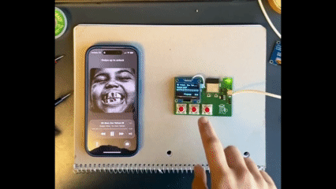
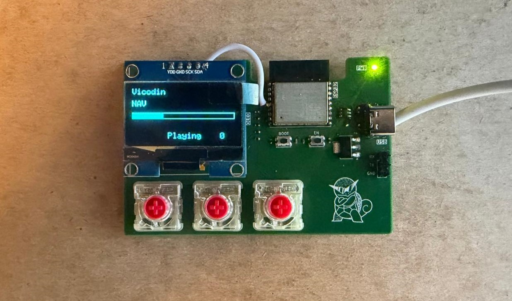

  <h1 align="center">ESP Spotify Player</h1>

  <p align="center">
    A Physical Spotify Remote, built around a custom ESP32-C3 PCB.
    <br />
    <a href="https://github.com/kaustubhdoval/ESP-Spotify-Player"><strong>Explore the docs »</strong></a>
    ·
    <a href="https://github.com/kaustubhdoval/ESP-Spotify-Player/issues">Report Bug</a>
    ·
    <a href="https://github.com/kaustubhdoval/ESP-Spotify-Player/issues">Request Feature</a>
  </p>

A hardware Spotify controller: buttons for play/pause/skip, a 128x64 OLED showing the current track and playback progress, and an on-device HTTPS server that handles the Spotify OAuth flow so no companion app or cloud middleman is needed. Ships as a from-scratch **KiCad PCB** (ESP32-C3) and also builds for a plain **ESP32 devkit** if you don't want to fab a board.

<p align="center">
  
</p>
<p align="center">
  
</p>
<p align="center">
  <em>
  Thanks to <a href="https://www.pcbway.com" target="_b;ank">PCBWay</a> for sponsoring fabrication!
  </em>
</p>
<br/>

## Features

- Play/pause, skip forward, skip back - instant, optimistic UI (screen updates before the Spotify API confirms)
- Live track name, artist, and playback-progress bar on a 128x64 SH1106 OLED
- Self-hosted OAuth: the ESP32 serves the Spotify login/callback pages itself over HTTPS, no server or app required
- Runs on a custom two-layer PCB (KiCad, ESP32-C3) **or** an off-the-shelf ESP32 devkit - see [Hardware](#hardware)

<br/>

## Repo Layout

```
src/    firmware (PlatformIO / Arduino framework)
pcb/    KiCad hardware design - schematic, PCB layout, fab/assembly outputs
lib/    vendored third-party library (patched for ESP32-C3 portability)
```

<br/>

## Hardware

This project supports two build targets. Pick whichever matches what you have.

|                         | Custom PCB                                        | Generic ESP32 Devkit                |
| ----------------------- | ------------------------------------------------- | ----------------------------------- |
| Board                   | ESP32-C3 (this repo's PCB)                        | Any classic ESP32 devkit            |
| Rotary encoder (volume) | Not populated                                     | Supported                           |
| PlatformIO environment  | `pcb`                                             | `devkit`                            |
| Where to get it         | Fab the board - see [View the PCB](#view-the-pcb) | Any ESP32 dev board you already own |

#### Wiring - Custom PCB (`env:pcb`)

| Component         | Pin   |
| ----------------- | ----- |
| OLED SDA          | GPIO6 |
| OLED SCL          | GPIO7 |
| Previous button   | GPIO5 |
| Play/Pause button | GPIO4 |
| Next button       | GPIO3 |

No rotary encoder on this board - GPIO2 is a strapping pin on ESP32-C3, so it was dropped from the design.

#### Wiring - Generic Devkit (`env:devkit`)

| Component         | Pin    |
| ----------------- | ------ |
| OLED SDA          | GPIO21 |
| OLED SCL          | GPIO22 |
| Previous button   | GPIO5  |
| Play/Pause button | GPIO18 |
| Next button       | GPIO19 |
| Encoder CLK       | GPIO4  |
| Encoder DT        | GPIO2  |
| Encoder SW        | GPIO15 |

> These pins are the environment defaults in `platformio.ini` - if your devkit's I2C or GPIOs are already used for something else, override them with `build_flags` in your environment rather than editing the source.

### View the PCB

The board is designed in KiCad. You can browse it interactively, no install required:

[**Open in KiCanvas »**](https://kicanvas.org/?github=https%3A%2F%2Fgithub.com%2Fkaustubhdoval%2FESP-Spotify-Player%2Fblob%2Fmain%2Fpcb%2FspotifyPlayerPcb.kicad_pro)

Or open the files directly: [schematic](pcb/spotifyPlayerPcb.kicad_sch) · [PCB layout](pcb/spotifyPlayerPcb.kicad_pcb) · [assembly drawing](pcb/plots/spotifyPlayerPcb__Assembly.pdf) · [fab output](pcb/output/spotifyPlayerPcb.zip)

<br/>

## Setup

You need an **application registered on the Spotify Developer Dashboard** with the Web API enabled.

1. Rename [`src/secrets_EXAMPLE.h`](src/secrets_EXAMPLE.h) to `src/secrets.h`.
2. Fill in your WiFi credentials and Spotify `CLIENT_ID` / `CLIENT_SECRET` in `secrets.h`.
3. Build and flash for your hardware:

   ```sh
   pio run -e pcb -t upload      # custom PCB (ESP32-C3)
   # or
   pio run -e devkit -t upload   # generic ESP32 devkit
   ```

   If PlatformIO can't find/upload to your board directly (common over USB-serial adapters), flash the built binaries with `esptool` instead. Just build first (`pio run -e pcb`), then:

   ```sh
   esptool --chip esp32c3 --port COM3 write-flash ^
     0x0     .pio\build\pcb\bootloader.bin ^
     0x8000  .pio\build\pcb\partitions.bin ^
     0x10000 .pio\build\pcb\firmware.bin
   ```

   For a `devkit` build, swap `--chip esp32c3` for `--chip esp32` and `.pio\build\pcb\` for `.pio\build\devkit\`. Adjust `COM3` to your board's port.

4. Open the Serial Monitor (115200 baud) or check the OLED for the ESP's IP address.
5. Add `https://<ESP_IP>/callback` as a Redirect URI on your Spotify app dashboard, and set the same value as `REDIRECT_URI` in `secrets.h`.
6. Re-flash with the updated `secrets.h`, then navigate to `https://<ESP_IP>` and log in with Spotify.

That's it - the device handles the OAuth exchange itself and starts controlling playback.

<br/>

## Dependencies

- adafruit/Adafruit GFX Library@^1.12.0
- adafruit/Adafruit SH110X@^2.1.12
- bblanchon/ArduinoJson@^7.4.1
- arduinogetstarted/ezButton@^1.0.6

Vendored locally in [lib/esp32_https_server](lib/esp32_https_server) (not pulled from the registry):

- fhessel/esp32_https_server@^1.0.0, patched to use `mbedtls_sha1` instead of the classic-ESP32-only `hwcrypto/sha.h`, so it builds on ESP32-C3 too.

<br/>

## Credits

- Inspired by [MakeItForLess's Spotify Player](https://gitlab.com/makeitforless/spotify_controller)
